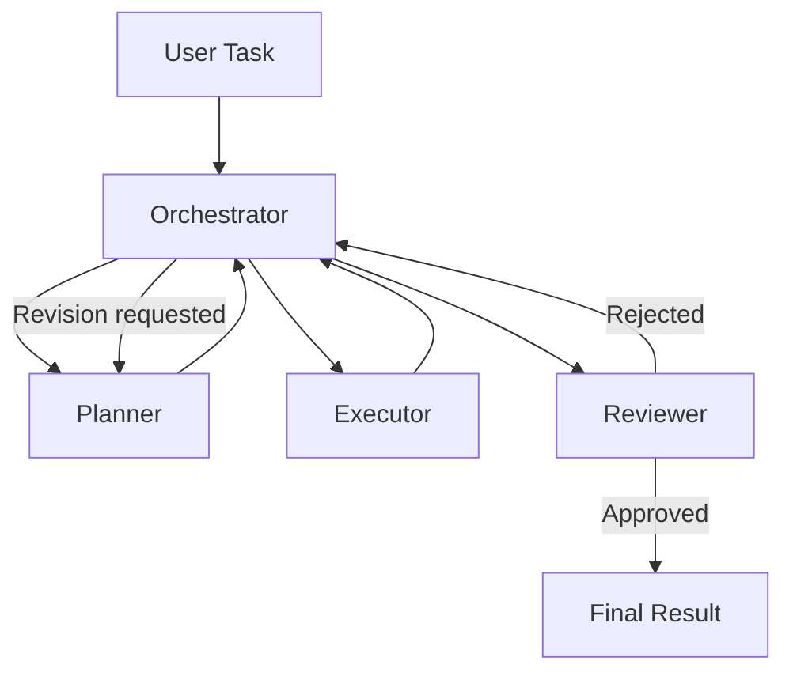

# standalone-agent-collaboration

A standalone, reusable **3-agent collaboration architecture**:
**Planner → Executor → Reviewer**, coordinated by an orchestrator over
a typed message protocol, with an iterative review/revision loop.

## 1. What this project is

A clean, self-contained implementation of a coordinated multi-agent
workflow: a Planner breaks a task down, an Executor carries out the
resulting subtasks, and a Reviewer checks the results against the
original task — approving them or sending them back for revision. It
ships with a deterministic mock LLM provider, so the whole system runs
and is testable completely offline, with no paid API required.

## 2. Why it is standalone

This repository has **no dependency on any other project or private
repository**. It contains no imports, paths, credentials, or
configuration referencing any other codebase. It's built from scratch
as a general-purpose pattern — clone it, run it, and adapt it for your
own multi-agent workflow.

## 3. Architecture

See [`docs/architecture.md`](docs/architecture.md) for the full
breakdown. In short:



Agents never call each other directly — every interaction is a
strongly typed `AgentMessage` routed through an in-process
`MessageBus`. See [`docs/protocol.md`](docs/protocol.md) for the full
message contract.

## 4. The three agents

| Agent | Role |
|---|---|
| **Planner** (`agents/planner/`) | Breaks the task into dependency-ordered subtasks and produces a structured `Plan`. Re-plans on rejection. |
| **Executor** (`agents/executor/`) | Executes an assigned subtask and returns a structured `ExecutionResult`. Never silently fails. |
| **Reviewer** (`agents/reviewer/`) | Validates results against the original task and returns a structured `Review`: approve or reject with actionable feedback. |

Details: [`docs/agents.md`](docs/agents.md).

## 5. Collaboration flow

```
Task -> Plan -> Execute -> Review -> Reject -> Revised Plan -> Execute Again -> Review -> Approve -> Complete
```

The revision loop is bounded by `system.max_revision_cycles` in
`config/collaboration.yaml` (default `3`) to prevent infinite loops.

## 6. Installation

Requires Python 3.11+.

```bash
git clone <this-repository>
cd standalone-agent-collaboration
python -m venv .venv && source .venv/bin/activate
pip install -e ".[dev]"
```

No API key or external service is required — the default LLM provider
is a deterministic, offline mock.

## 7. Configuration

All system configuration lives in [`config/collaboration.yaml`](config/collaboration.yaml):

```yaml
system:
  name: standalone-agent-collaboration
  max_revision_cycles: 3

agents:
  planner: { enabled: true }
  executor: { enabled: true }
  reviewer: { enabled: true }

workflow:
  require_review: true
  fail_fast: false

llm:
  provider: mock   # swap for a real provider once one is wired up

logging:
  level: INFO
```

Each agent also has its own default config at `agents/<role>/config.yaml`
(e.g. the Reviewer's approval score threshold, the Planner's max
subtask count). Configuration is loaded and passed in — nothing is
hard-coded, and no secrets are stored in any YAML file. See
[`.env.example`](.env.example) for the only environment variable the
system knows about (used solely if you plug in a real LLM provider).

## 8. Running the example

```bash
python examples/basic_task.py       # straight-through approval
python examples/sample_workflow.py  # demonstrates a reject -> revise -> approve cycle
```

Or via the CLI:

```bash
python -m app "Create a project plan for launching a website"
python -m app "Create a project plan for launching a website" --json   # machine-readable, non-zero exit on failure
```

## 9. Running tests

```bash
pytest
```

25 tests cover agent behavior in isolation, message protocol
validation, message bus routing, and full orchestration scenarios
(successful workflow, rejected review + revision, executor failure,
reviewer failure, and the maximum-revision-cycle limit). All tests run
offline in a fraction of a second.

## 10. Adding another agent

See [`docs/agents.md`](docs/agents.md#adding-another-agent) for the
step-by-step guide: create `agents/<role>/`, subclass `BaseAgent`,
register it as a known recipient, subscribe it to the bus, and wire it
into the orchestrator's workflow.

## 11. Replacing the mock LLM provider

Agents depend on the small `LLMProvider` interface
(`core/llm_provider.py`), never a specific vendor SDK. To go live:
subclass `RealLLMProvider`, implement `complete()` against your chosen
vendor, read the API key from an environment variable, and update
`build_llm_provider()` in `app/bootstrap.py`. Full details in
[`docs/development.md`](docs/development.md#replacing-the-mock-llm-provider).

## 12. Extending the state backend

`core/state_manager.py` defines a small `StateBackend` interface with
an in-memory default implementation. Add a database-backed
implementation (SQLite, Postgres, ...) without touching any agent or
orchestrator code — see
[`docs/development.md`](docs/development.md#extending-the-state-backend).

## 13. Development workflow

Full details, including code style and Git conventions, in
[`docs/development.md`](docs/development.md).

## Repository structure

```
standalone-agent-collaboration/
├── README.md
├── LICENSE
├── .gitignore
├── .env.example
├── pyproject.toml
│
├── agents/
│   ├── planner/{agent.py, prompts.py, config.yaml}
│   ├── executor/{agent.py, prompts.py, config.yaml}
│   └── reviewer/{agent.py, prompts.py, config.yaml}
│
├── core/
│   ├── orchestrator.py
│   ├── agent.py
│   ├── message_bus.py
│   ├── task_manager.py
│   ├── state_manager.py
│   ├── protocol.py
│   ├── llm_provider.py
│   ├── errors.py
│   └── logging.py
│
├── schemas/
│   ├── task.py, message.py, plan.py, result.py, review.py
│
├── config/
│   └── collaboration.yaml
│
├── app/                    # CLI entrypoint (python -m app "...")
│   ├── __main__.py
│   └── bootstrap.py
│
├── tests/
│   ├── test_agents.py, test_message_bus.py, test_orchestrator.py
│   ├── test_protocol.py, test_review_cycle.py
│
├── examples/
│   ├── basic_task.py
│   └── sample_workflow.py
│
└── docs/
    ├── architecture.md, agents.md, protocol.md, development.md
```

## License

MIT — see [`LICENSE`](LICENSE).
