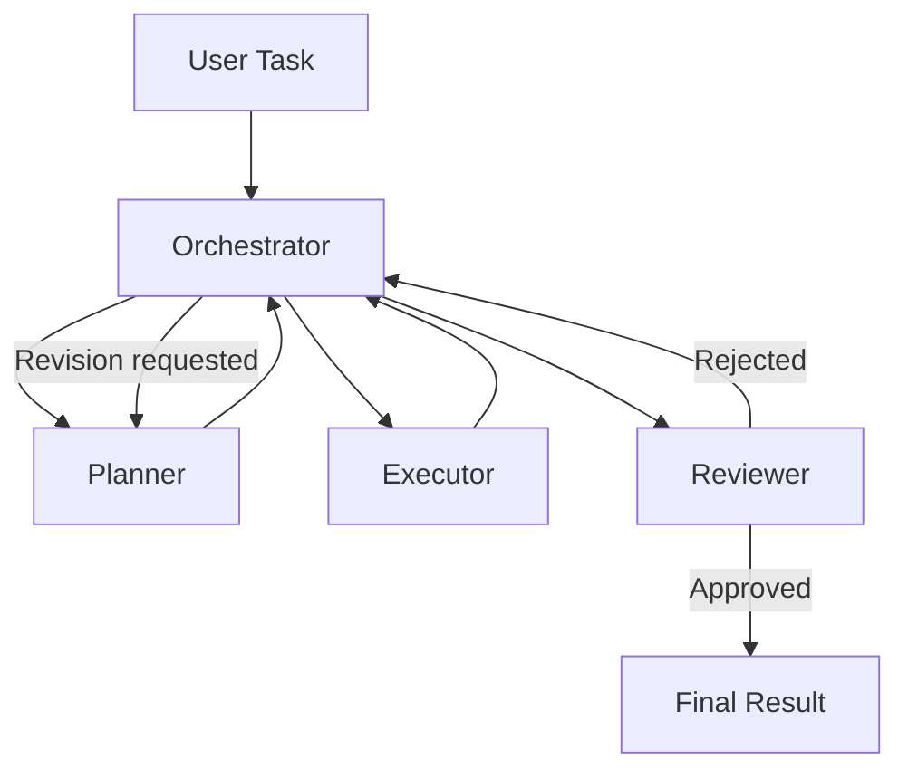

# Architecture

## Overview

This system coordinates three independent agents — **Planner**,
**Executor**, and **Reviewer** — through a shared, in-process
collaboration layer. No agent calls another agent's code directly;
every interaction is a strongly typed message routed through the
`MessageBus`. This is what makes each agent independently testable and
independently replaceable.

```
User Task
   |
   v
Planner --creates plan--> Executor --produces result--> Reviewer
                                                            |
                                              +-------------+-------------+
                                              |                           |
                                          approved                    rejected
                                              |                           |
                                              v                           v
                                        Final Result                  Planner
                                                                    (revised plan)
                                                                           |
                                                                           v
                                                                       Executor
                                                                     (re-execute)
```

## Mermaid diagram



## Layers

| Layer | Responsibility | Location |
|---|---|---|
| Schemas | Typed data contracts: messages, tasks, plans, results, reviews | `schemas/` |
| Protocol | Validation rules for messages (required fields, known recipients) | `core/protocol.py` |
| Message bus | In-process async publish/subscribe and routing | `core/message_bus.py` |
| Agents | Planner, Executor, Reviewer — each independently testable | `agents/` |
| State manager | Storage-agnostic shared workflow state | `core/state_manager.py` |
| Task manager | Task lifecycle / status transitions | `core/task_manager.py` |
| Orchestrator | Coordinates the full workflow and the revision loop | `core/orchestrator.py` |
| LLM provider | Vendor-agnostic completion interface (mock by default) | `core/llm_provider.py` |
| App/CLI | Wiring + command-line entrypoint | `app/` |

## Design principles

1. **Agents communicate only through messages.** No agent imports
   another agent's module. This means you can unit test the Planner,
   Executor, and Reviewer entirely in isolation (see `tests/test_agents.py`),
   and it means a new agent role can be added without touching the
   others' code.

2. **Structured output everywhere.** Plans, execution results, and
   reviews are dataclasses with explicit fields, not free-form text.
   Workflow-critical decisions (approve/reject, success/failure) are
   never inferred from prose.

3. **The orchestrator owns the workflow shape.** Only `core/orchestrator.py`
   knows about the plan → execute → review → (approve | revise) loop
   and the revision-cycle limit. Agents don't know they're part of a
   loop at all.

4. **Storage-agnostic state.** `StateManager` is backed by an
   `InMemoryStateBackend` by default, but the interface (`get`/`put`/
   `delete`/`all_task_ids`) is small enough to implement against a real
   database without changing any agent or orchestrator code.

5. **Vendor-agnostic LLM layer.** Agents depend on the `LLMProvider`
   interface, not a specific vendor SDK. `MockLLMProvider` is
   deterministic and offline, which is what makes the test suite and
   the examples runnable without any external service or API key.

## Data flow for one workflow cycle

1. `Orchestrator.run(title, description)` creates a `Task` (via
   `TaskManager`) and a `WorkflowState` (via `StateManager`).
2. It publishes a `TASK_CREATED` message to `planner`, receives a
   `PLAN_CREATED` reply containing a `Plan`.
3. It iterates the plan's `execution_order`, publishing a
   `TASK_ASSIGNED` message per subtask to `executor`, collecting an
   `ExecutionResult` from each `EXECUTION_COMPLETED` / `EXECUTION_FAILED`
   reply.
4. It aggregates all subtask results into one `ExecutionResult` and
   publishes a `REVIEW_REQUESTED` message to `reviewer`, receiving a
   `Review` back via `REVIEW_APPROVED` or `REVIEW_REJECTED`.
5. If approved, the workflow finalizes and returns a `WorkflowResult`.
   If rejected, the orchestrator records the revision, sends the
   Reviewer's feedback back to the Planner as a `REVISION_REQUESTED`
   message, and repeats from step 2 — up to `max_revision_cycles`
   times, after which the task fails with `MaxRevisionCyclesExceededError`.
